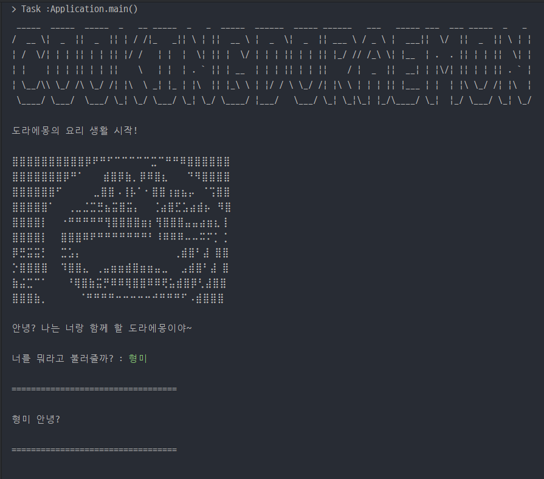
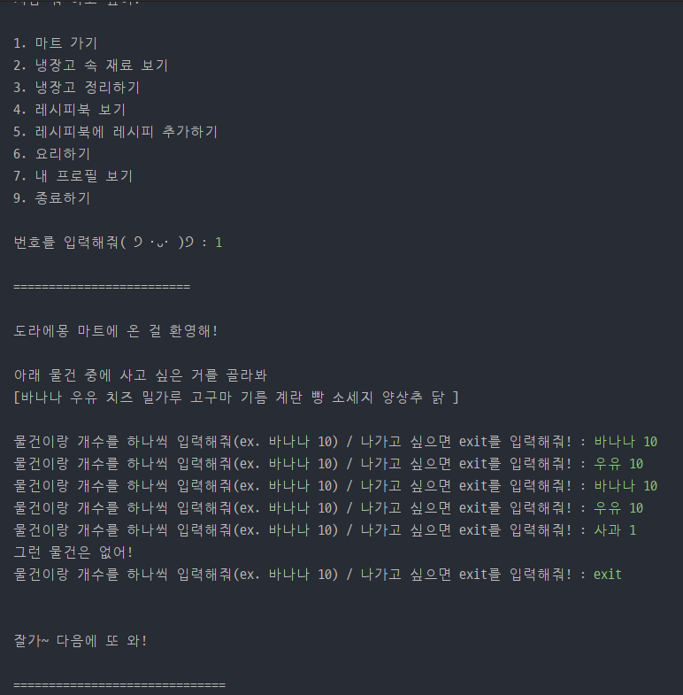
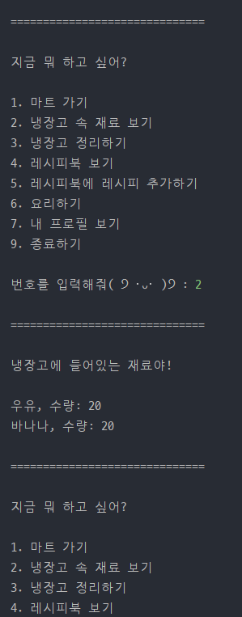
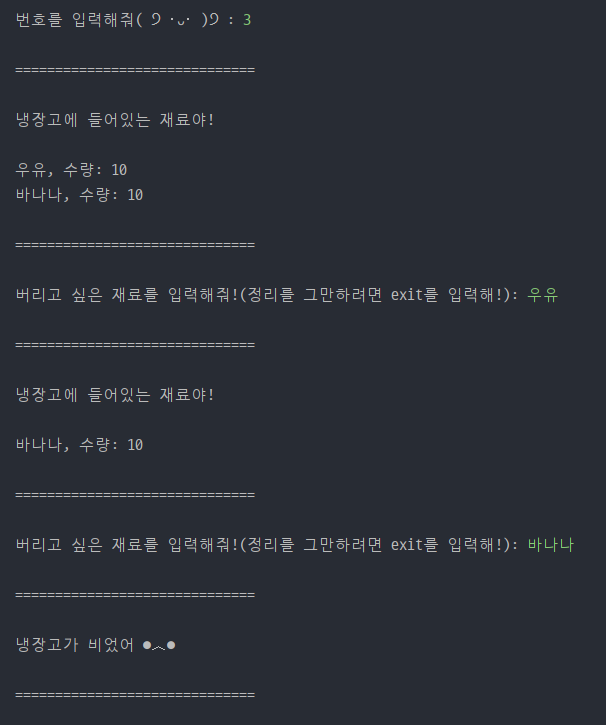
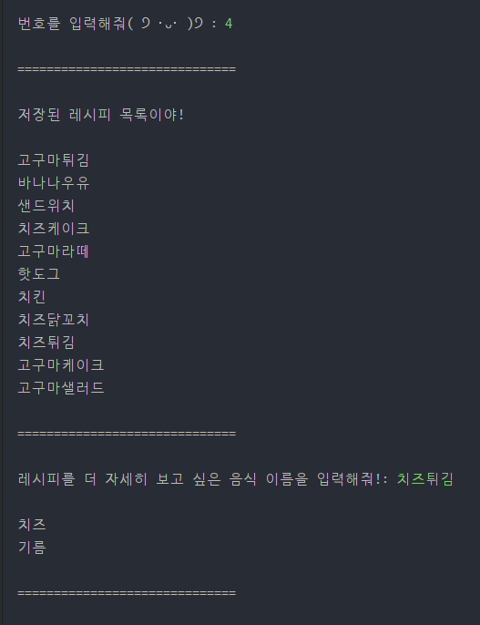
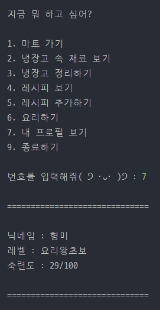
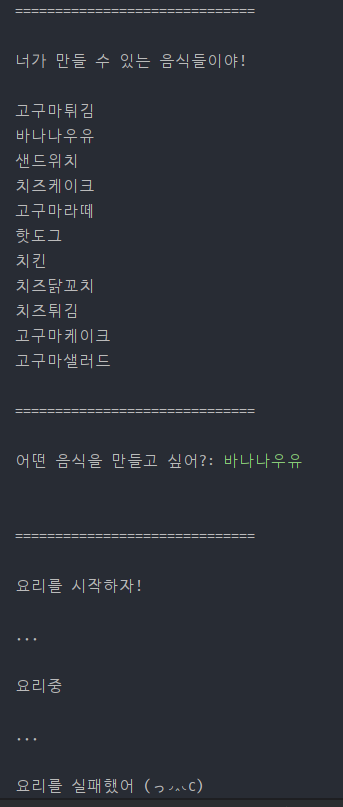
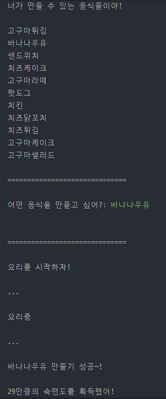
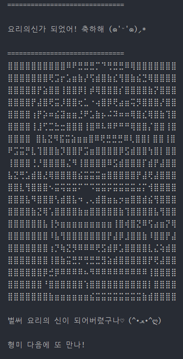

# Cooking Doraemon

## 🕵️ 팀원

|||
|:-:|:-:|
|권형미 [@hyomee2](https://github.com/hyomee2)|김영기 [@we4sley](https://github.com/we4sley)|

---

##  📝 프로젝트 소개

> `Cooking Doraemon`은 `user`가 레시피를 보고 요리를 해보면서 숙련도를 쌓아 성장해나가는 텍스트 기반의 콘솔 게임입니다.
> `user`는 마트에서 재료를 얻어 냉장고에 재료가 저장되고 냉장고에 있는 재료를 가지고 레시피를 보고 요리를 진행하며 게임을 진행합니다.
> 초기에 `요리왕초보` 레벨에서 진행하기 시작하여 `요리적응러`, `요리마스터`를 지나 `요리의 신`이 되면 게임이 클리어 됩니다. 

---

##  📁 디렉토리 구조

---

## ⚙️기술 스택

    

---

## 🚀 기능 설명
* 유저 이름을 입력하면서 게임이 시작됩니다.
* 유저는 '요리왕초보' 레벨, 숙련도 0으로 게임을 시작합니다.
* 각 레벨의 숙련도 최댓값은 100이며, 100이 넘어갈 경우 자동으로 다음 레벨로 넘어갑니다.

##  1. 마트 가기
   * 마트에 존재하는 재료 중 원하는 상품을 원하는 수량만큼 구매할 수 있습니다.
   * 원하는 상품과 수량을 입력하여 장바구니에 담을 수 있고, 마트 퇴장 시 장바구니의 품목들이 냉장고에 저장됩니다.
   * 기본적으로 10종의 재료가 마트에 존재합니다.
##  2. 냉장고 속 재료 보기
   * 냉장고에 존재하는 재료 이름과 갯수를 확인할 수 있습니다.
##  3. 냉장고 정리하기
   * 냉장고에 존재하는 재료를 폐기할 수 있습니다.
##  4. 레시피 보기
   * 레시피 리스트에서 원하는 음식의 레시피를 확인할 수 있습니다.
   * 기본적으로 10가지의 음식 레시피가 레시피에 추가되어 있습니다.
##  5. 레시피 추가하기
   - 추가하고 싶은 음식의 이름과 재료를 입력하여 레시피 리스트에 새로운 레시피를 추가할 수 있습니다.
##  6. 요리하기
   * 원하는 음식을 요리할 수 있습니다.
   * 단, 요리하고 싶은 음식이 레시피에 등록되어 있고, 냉장고에 해당 음식을 요리하는데 필요한 재료가 모두 존재해야만 요리가 진행됩니다.
   * 요리가 진행되면 75:25의 비율로 성공과 실패가 결정되며, 성공할 경우 20~30 사이의 숙련도를 획득할 수 있습니다.
##  7. 내 프로필 보기
   * 유저의 이름과 현재 레벨, 그리고 숙련도를 확인할 수 있습니다.
##  8. 종료하기
   * 게임이 종료됩니다.

---
## 실행화면
1. 시작

     
2. 마트가기

     
3. 냉장고 속 재료 보기

     
4. 냉장고 정리하기

     
5. 레시피 보기

     
6. 레시피 추가하기

     

     
7. 프로필 보기

     

     
8. 요리하기

     

     
9. 레벨업

     
10. 게임종료

---